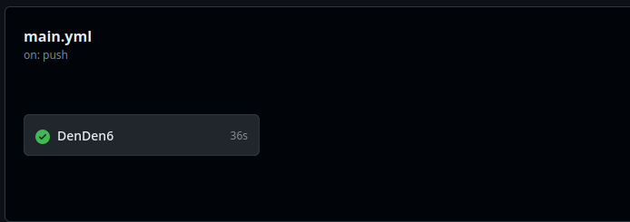
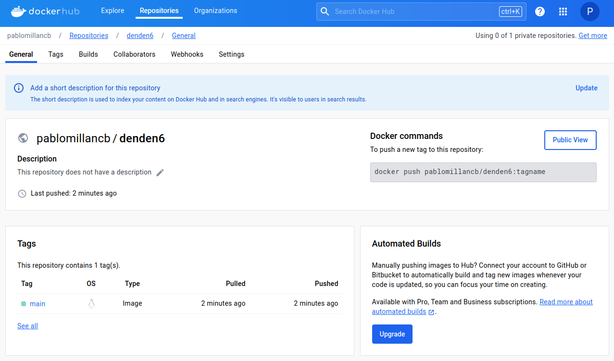

## Elección de contenedor base

Para el contenedor base se ha decidido utilizar [node](https://hub.docker.com/_/node), que es la imagen oficial de Node.js, mantenida por los propios desarrolladores. Como el proyecto se desarrolla con Node, es muy útil emplear de base una ISO que ya contiene todo lo que necesitas de Node para ejecutar la mayoría de proyectos de este. Además, se cuentan con varios *sabores* para este contenedor base. El estándar está basado en Debian, pero existe otra versión con *Alpine*, una distribución de Linux basada en Arch más ligera. Se escogerá esta por eso mismo, concretamente la versión 21.4.

## Configuración de Dockerfile

A continuación se creó el [*Dockerfile*](https://github.com/pabloMillanCb/DenDen6/blob/main/Dockerfile) donde se describe las instrucciones para construir el contenedor. Se van a ir comuntando una a una las lineas del archivo.

Se indica el contenedor base sobre el que se va a construir.
```
FROM node:21.4-alpine
```
Se establece el directorio de trabajo del contenedor.
```
WORKDIR /src
```
Se copian todos los archivos de configuración de node.
```
COPY package*.json ./
```
Se ejecutan comandos de *mode package manager* para instalar todos los paquetes y actualizar todas las dependencias.
```
RUN npm install && npm update
```
Se copian al contenedor la carpeta */src* con el código del proyecto y */test* con los tests que se ejecutarán.
```
COPY src/. ./
COPY test/. ./
```
Se indica la orden para ejecutar los tests del proyecto.
```
CMD ["npm", "run", "test"]
```

## Construcción y ejecución de imagen

Para construir la imagen se ejecuta en nuestra terminal la siguiente orden colocándonos en el directorio raíz del repositorio:
```
sudo docker build -t denden6 .
```

Una vez terminada la compilación, para correrlo:
```
sudo docker run -it --rm denden6
```
Obtenemos la siguiente salida:
```
 ✓ personaje.test.ts (8)
 ✓ session.test.ts (5)

 Test Files  2 passed (2)
      Tests  13 passed (13)
   Start at  15:50:52
   Duration  544ms (transform 146ms, setup 0ms, collect 181ms, tests 48ms, environment 1ms, prepare 187ms)


 PASS  Waiting for file changes...
       press h to show help, press q to quit

```

## Subida a Docker Hub y GitHub Packages

Se siguió la [guía oficial de GitHub](https://docs.github.com/es/actions/publishing-packages/publishing-docker-images#publicar-im%C3%A1genes-en-docker-hub-y-en-github-packages) para la publicación de imágenes en Docker Hub y GitHub Packages. Para ello se tuvieron que definir dos *secretos* de GitHub que almacenaran el usuario y contraseña de la cuenta de DockerHub.


Se creó un `main.yaml` como el de la guía. Se introdujo en este el nombre de la imagen y del usuario de DockerHub tras el apartado `images`, que será el mismo del proyecto, y se indicó que se ejecute la *GitHub Action* cada vez que se pushee algo a la rama main del repositorio. Para ello se introdujo estas lineas al principio del documento:
```
on:
  push:
    branches: ['release']
```
Al realizar el siguiente push, se ejecuta la acción automáticamente:



Se puede consultar el repositorio de Dockerhub [aquí](https://hub.docker.com/repository/docker/pablomillancb/denden6/general).

